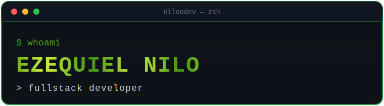
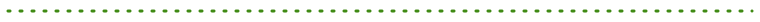
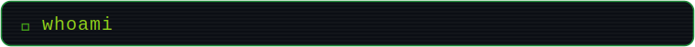
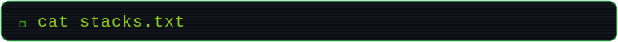
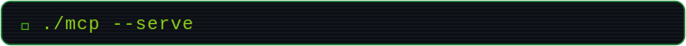
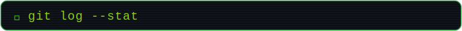
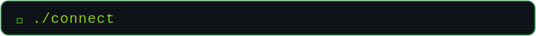

<!-- ╔══════════════════════════════════════════════════════════════════╗ -->
<!--   Profile README — @niloodev 🐸  (frog-dev green)                    -->
<!--   How to edit stacks: each category uses skillicons.dev.             -->
<!--   Open the image link and add/remove the slug inside "i=".           -->
<!--   Full slug list: https://skillicons.dev                            -->
<!-- ╚══════════════════════════════════════════════════════════════════╝ -->

<!-- ░░░ HEADER ░░░ -->

  

<code>@niloodev</code>

<!-- Animated headline. Edit the phrases inside "lines=" -->

  

 

<!-- ░░░ ABOUT ░░░ -->
<h2></h2>

> Fullstack developer who treats code as both craft and play. I take quality and good practices seriously, but I like keeping the process light. My thing is taking a messy problem and handing back a clean solution, because complex things are just a set of simple things put together.

<!-- ════════════════════════ STACKS ════════════════════════ -->
<!--
  HOW TO ADD A STACK (each icon is its own tile, with a hover name):
  Copy one  line, then change the slug after "i=" and the title/alt text:
    
  Find slugs at https://skillicons.dev (e.g. "go", "rust", "tailwind").
  The "title" text is the name that pops up when you hover the icon on GitHub.
  To create a NEW category, copy a whole 
 block.
-->
<h2></h2>

  
<b>📂 <code>languages/</code></b>

   
  
  
  
  
  
  
  

  
<b>📂 <code>frontend/</code></b>

   
  
  
  
  
  
  
  
  
  
  
  
  
  

  
<b>📂 <code>backend/</code></b>

   
  
  
  
  

  
<b>📂 <code>databases/</code></b>

   
  
  
  
  
  
   
  Plus Oracle and the other SQL variants.

  
<b>📂 <code>devops/</code></b>

   
  
  
  
  
  
  
  
  
  
   
  Deep on AWS (EKS, ECR, ECS and more) and the Google Cloud equivalents.

  
<b>📂 <code>tools/</code></b>

   
  
  
  
    
  
  
  
  
  
  
  

  
<b>📂 <code>desktop-games/</code></b>

   
  
  
  
  

 

<!-- ░░░ MCP ░░░ -->
<h2></h2>

I design and ship **MCP servers** that plug LLMs into real tools, data and systems.

- Build over **JSON-RPC 2.0**, exposing the three server primitives as first-class citizens: **Tools** (model-callable functions), **Resources** (contextual data) and **Prompts** (reusable templates).
- Ship across both transports: **stdio** for local hosts and **Streamable HTTP** for remote servers, with proper capability negotiation on the `initialize` handshake.
- Use the official **TypeScript** and **Python** SDKs, with typed tool schemas (Zod / JSON Schema) and structured error handling.
- Handle the advanced flows too: **sampling** (server-initiated model calls), **roots**, **elicitation**, progress notifications and cancellation.
- Wire servers into hosts like Claude Desktop and IDE clients, with auth and least-privilege scoping.

 

<!-- ░░░ STATS ░░░ -->
<h2></h2>

  
  

  

<!-- Animated contribution graph (green). Remove this block if you don't want it. -->

 

<!-- ░░░ CONNECT ░░░ -->
<h2></h2>

  
  

 

<!-- ░░░ SNAKE (generated by the snakes.yml action) ░░░ -->
<picture>
  <source media="(prefers-color-scheme: dark)" srcset="https://raw.githubusercontent.com/niloodev/niloodev/output/github-contribution-grid-snake-dark.svg" />
  <source media="(prefers-color-scheme: light)" srcset="https://raw.githubusercontent.com/niloodev/niloodev/output/github-contribution-grid-snake.svg" />
  
</picture>

<!-- ░░░ FOOTER ░░░ -->

<code>// thanks for scrolling — press START to continue</code>

